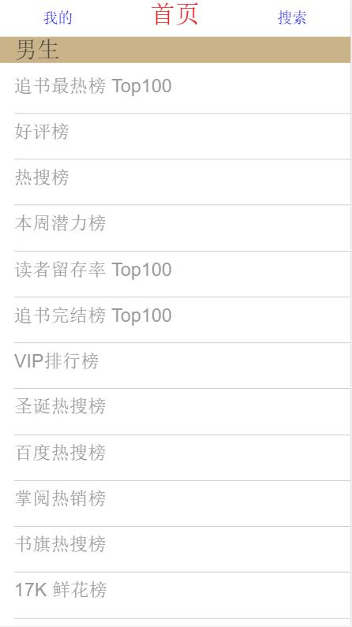
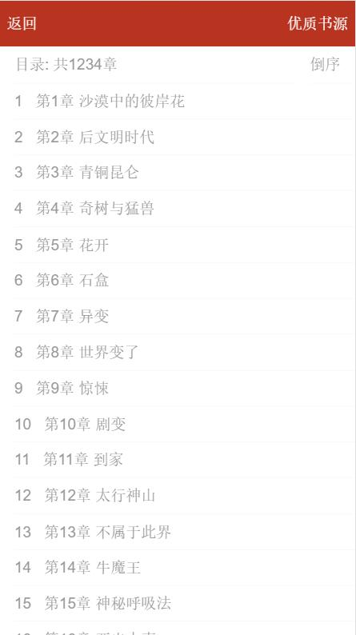

## book-mall

## 技术栈
1. axios^0.18.0
> 基于Promise的 HTTP库,用来访问接口
2. jsonp^0.2.1
> 跨域解决方案
3. prop-types^15.6.1
> 类型检测
4. react-router^4.2.0
> 路由管理
5. react-redux
> 状态管理

## 项目结构
    Fashion-Music
    ├── build   // webpack 相关配置和脚本
    ├── public  // 引用的静态资源
    ├── node_modules //npm命令下载的开发环境和生产环境的依赖包。
    ├── preview  //项目运行界面截图
    ├── src  //项目源码及需要引用的资源文件
        ├── api  // 接口配置,请求以及跨域
        ├── assets // 共用的图片等
        ├── components  // 基础组件, 不做交互等操作
            ├── book.js // 书籍
            ├── chaoters.js // 章节类别
            ├── detailcontent.js // 书籍详情
            ├── read.js // 阅读页面
            ├── ...
        ├── container  //业务组件,实现具体功能
            ├── rankCategory.js // 排行榜 书籍列表
            ├── rankmale.js // 男生排行榜
            ├── read.js // 阅读页面功能实现
            ├── shelf.js // 书架
            ├── bookdetail.js // 书籍详情页
            ├── ...
        ├── js // 共用的函数等
        ├── sass // sass预处理器
        ├── store // vuex相关文件
        ├── index.js  //项目入口
        ├── style //样式文件
        ├── reducer // react-redux 文件
        ├── actions // react-redux 提交的action
    ├──package.json  //node_modules资源部 和 启动、打包项目的 npm 命令管理 

## 重点难点
1. 组件划分
2. react-redux设计
3. 接口返回的结果处理
4. 组件传值

## 运行界面

-------

-------

